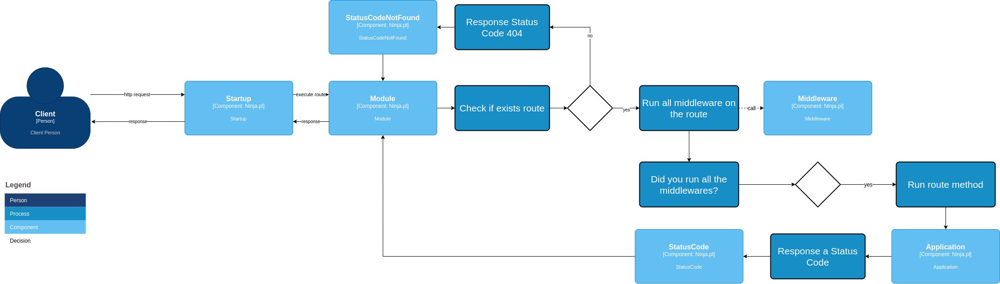

# Framework Ninja.pl! Web Api

<br>

## Motivação
> A motivação é facilitar o desenvolvimento de aplicações voltadas para a web, permitindo que os desenvolvedores utilizem injeções de depedência promovendo desacoplamento de suas aplicações, e também organizem melhor seu código com Módulos assim facilitando o desenvolvimento de novas arquiteturas. O framework também conta com uma biblioteca de validação de tipos, onde é possível definir o padrão do payload com multiplos nível e validando o payload de uma só vez. Também é possível utilizar o ORM Sequelado para utilização de models e comunicações com o banco de dados.

## Documentação

### Fluxograma de Requisições


### Instalação na DEVBOX
> A devbox vem inicialmente desatualizada e devemos inserir os arquivos do repositório git faltando na mesma e checar as permissões dos arquivos faltante, garantir que os arquivos estejam pelo menos com permissão 755 ou 744.
    
### Arquivos faltantes da API na DEVBOX pasta GLOBAL
> Pasta inteira APP/public_html/cgi-local/api

> Arquivo htaccess APP/public_html/.htaccess

## Dirétorio Inicial

### Startup.cgi
> Este serve como ponto de entrada para todas as requisições na WebAPI, nele é possível interceptar as requisições através de Middlewares, e aplicar regras que possam servir para uma ou mais rotas.Também é realizado o Autoload das bibliotecas padrões do projeto e da Aplicação a ser executada.

## src/App

### Modules
> Um módulo é responsável por gerenciar sua aplicação, com ele é possível:
> - Registrar providers para utilizar em injeção de depedências
> - Registrar um controller que servirá como porta de entrada para sua aplicação
> - Resolver injeções de deped?ncia: Caso um módulo esteja configurado, para receber uma dependência, é o Module que fica responsável por resolver.
> - Registrar outros Modules: Esse recurso permite organizar melhor sua aplicação, onde em uma arquitetura em camadas, você pode registrar seus providers e controllers em camadas mais internas e depois agrupar todos os módulos em apenas um.
> - Executar uma rota: Passando os parâmetros necessários, o módulo busca a rota informada e executa seu devido controller.
<Br>
> Exemplo:
```
package V1::Department::TodoModule;
{
    use V1::Libraries::Module::Module;    
    our @ISA = qw(V1::Module);
    use V1::Modules::Department::Application::Modules::Providers::CoreProviders;
    use V1::Modules::Department::Application::Modules::Providers::InfraProviders;

    sub new {
        my ($class) = @_;

        my $self = {}; 
        my $self = $class->SUPER::new();                   

        bless $self, $class; 

        $self->registerRoute('post', '/api2/v1/Department/Todo1/Sell', 'V1::Modules::Department::Application::Controllers::Http::Todo1Controller', 'V1::Todo1Controller', 'sellTodo1', [$middleware]);
        $self->registerRoute('post', '/api2/v1/Department/Todo1', 'V1::Modules::Department::Application::Controllers::Http::Todo1Controller', 'V1::Todo1Controller', 'createTodo1', [$middleware]);
        $self->registerProvider(V1::Department::CoreProviders::TODO1_SERVICE_PROVIDER, 'V1::Modules::Department::Core::Services::Todo1::Todo1Service', 'V1::Todo1Service', 
            #we can return all provider dependencies
            [
                V1::Department::InfraProviders::TODO1_REPOSITORY_PROVIDER, V1::Department::InfraProviders::FOO_COMMUNICATION_ADAPTER_PROVIDER
            ], 
            sub {
                #we can return all provider dependencies
                return ();
            }
        );
        $self->registerModule(V1::Foo::FooModule->new());     

        return $self;
    }      

}
1;
```


### Status Code
> A biblioteca status code serve como uma forma de padronizar toda a comunicação entre seu sistema, possibilitando que retorne desde mensagens formatadas com sucesso, erro ou alertas. Para Rest Api's, é possível utilizar a biblioteca Response.pm para retornar uma mensagem formatada ao cliente, devolvendo com o código de status correto. Por padrão o Startup.cgi já utilizar o Response.pm para retornar a mensagem de todas as requisições.

### Controllers
> O controller serve como porta de entrada para a camada externa da aplicação, todas as requisições HTTP passam obrigatóriamente por ele.
<br><br>
> <b>Injeção de depedência:</b>
<br>
> Para utilizar injeção de dependência no controller, basta declarar duas constantes no package.
<br><br>
> use constant USE_DEPENDENCY_INJECTION => 1;
<br>
> use constant DEPENDENCIES_PROVIDERS => [
        'FooService', 'TodoService'
    ];
<br><br>
> Isso faz com que o módulo identifique que ele precisa instânciar estes providers e passa-los obrigatoriamente no método construtor do Controller.
<br><Br>
> Exemplo:
<br><Br>
```
package V1::Todo1Controller;
{    
    use V1::Modules::Department::Application::Modules::Providers::CoreProviders;
    use constant USE_DEPENDENCY_INJECTION => 1;
    use constant DEPENDENCIES_PROVIDERS => [
        V1::Department::CoreProviders::TODO1_SERVICE_PROVIDER, V1::Department::CoreProviders::SELL_TODO1_SERVICE_PROVIDER
    ];
    sub new {
        my ($class, $todo1Service, $sellTodo1Service) = @_;
        
        return bless {
            "todo1Service" => $todo1Service,
            "sellTodo1Service" => $sellTodo1Service
        }, $class;
    }

    sub sellTodo1 {
        my ($self, $payload) = @_;

        return $self->{"sellTodo1Service"}->execute($payload);
    }

    sub createTodo1 {
        my ($self, $payload) = @_;
    
        return $self->{"todo1Service"}->create($payload);
    }

    sub getTodo1ById {
        my ($self, $payload) = @_;        
        
        return $self->{"todo1Service"}->getById($payload);
    }
}
1;
```
### Routes
> Para registrar uma rota em seu módulo, basta utilizar esse comando no método construtor do módulo:
<br><br>
```
package V1::Department::ApplicationModule;
{
    use V1::Libraries::Middlewares::AuthenticateMiddleware;
    use V1::Libraries::Module::Module;    
    our @ISA = qw(V1::Module);

    sub new {
        my ($class) = @_;

        my $self = {}; 
        my $self = $class->SUPER::new();                   

        bless $self, $class;

        $self->registerTodo1Controller();          

        return $self;
    }      

    sub registerTodo1Controller {
        my ($self) = @_;

        my $middleware = V1::AuthenticateMiddleware->new();

        $self->registerRoute('post', '/api2/v1/Department/Todo1/Sell', 'V1::Modules::Department::Application::Controllers::Http::Todo1Controller', 'V1::Todo1Controller', 'sellTodo1', [$middleware]);
        $self->registerRoute('post', '/api2/v1/Department/Todo1', 'V1::Modules::Department::Application::Controllers::Http::Todo1Controller', 'V1::Todo1Controller', 'createTodo1', [$middleware]);
        $self->registerRoute('get', '/api2/v1/Department/Todo1', 'V1::Modules::Department::Application::Controllers::Http::Todo1Controller', 'V1::Todo1Controller', 'getTodo1ById', []);
        $self->registerRoute('get', '/api2/v1/Department/Todo2', 'V1::Modules::Department::Application::Controllers::Http::Todo2Controller', 'V1::Todo2Controller', 'getTodo2ById', []);
    }
}
1;
```
> - 1º Parâmetro: Verbo da requisição (padrão caixa baixa)
> - 2º Parâmetro: URI (Aqui você define a rota de acesso que deverá ser utilizada pelo cliente. OBS: Deve existir apenas uma rota com o mesmo nome por verbo, caso contrário você terá problemas!)
> - 3º Parâmetro: Use Package (Aqui você deve informar como o módulo deve utilizar o use package do controller)
> - 4º Parâmetro: Package Name (Aqui você informa o nome do package do Controller)
> - 5º Parâmetro: Function Name (Aqui você informa qual é o nome da sub que o módulo deverá executar)
> - 6º Parâmetro: Middlewares (Aqui você pode instanciar e utilizar uma lista de middlewares para serem executados antes de ser acessado o método de destino no controller).

### Middlewares
> O middleware é uma classe executada antes do módulo executar a rota de destino. A requisição é interceptada pelo middleware, no qual possibilita validar a sessão do usuário, se o mesmo possui permissão para acessar aquela rota, entre outras validações. Também é possível incluir informações do middleware no payload, por exemplo dados de sessão do usuário.

### Type
> Com o módulo Type é possível definir validadores customizaveis para um payload, como um validador de classes. Também é possível setar um type dentro do outro, possibilitando que faça uma validação recursiva de seu payload.
<Br><br>
> Exemplo:
<Br>
```
package V1::CreateTodo1RequestDTO;
{
    use PayloadAttributes;
    use RequiredValidator;
    use IntegerValidator;
    our @ISA = qw(V1::PayloadAttributes);

    sub new {
        my ( $class ) = @_;        
        my $self = $class->SUPER::new();               
        bless $self, $class;

        my $phone = V1::PayloadAttributes->new();
        $phone->setAttribute("phone", [>
        my $address = V1::PayloadAttributes->new();
        $address->setAttribute("address", [
                V1::RequiredValidator->new("Field 'address' is required!")
        ]);
        $address->setAttribute("city", [
                V1::RequiredValidator->new("Field 'city' is required!")
        ]);
        $address->setPayloadAttribute("phone", $phone, [
                V1::RequiredValidator->new("Field 'phone' is required!")
        ]);

        $self->setAttribute("name", [
                V1::RequiredValidator->new("Field 'name' is required!")
        ]);
        $self->setAttribute("email", [
                V1::RequiredValidator->new("Field 'email' is required!")
        ]);
        $self->setAttribute("years", [
                V1::RequiredValidator->new("Field 'years' is required!"),
                V1::IntegerValidator->new("Field 'years' is required!")
        ]);
        $self->setPayloadAttribute("address", $address, [
                V1::RequiredValidator->new("Field 'address' is required!")
        ]);
        return $self;
    }
}
1;
```

### Injeção de Dependência
> <b>Controllers:</b>
> <br><br>
> Para utilizar injeção de dependência no controller, basta declarar duas constantes no package.
<br><br>
> use constant USE_DEPENDENCY_INJECTION => 1;
<br>
> use constant DEPENDENCIES_PROVIDERS => [
        'FooService', 'TodoService'
    ];
<br><br>
> Isso faz com que o módulo identifique que ele precisa instânciar estes providers e passa-los obrigatoriamente no método construtor do Controller.
<br><Br>
> Exemplo:
<br><Br>
```
package V1::Todo1Controller;
{    
    use V1::Modules::Department::Application::Modules::Providers::CoreProviders;
    use constant USE_DEPENDENCY_INJECTION => 1;
    use constant DEPENDENCIES_PROVIDERS => [
        V1::Department::CoreProviders::TODO1_SERVICE_PROVIDER, V1::Department::CoreProviders::SELL_TODO1_SERVICE_PROVIDER
    ];
    sub new {
        my ($class, $todo1Service, $sellTodo1Service) = @_;
        
        return bless {
            "todo1Service" => $todo1Service,
            "sellTodo1Service" => $sellTodo1Service
        }, $class;
    }

    sub sellTodo1 {
        my ($self, $payload) = @_;

        return $self->{"sellTodo1Service"}->execute($payload);
    }

    sub createTodo1 {
        my ($self, $payload) = @_;
    
        return $self->{"todo1Service"}->create($payload);
    }

    sub getTodo1ById {
        my ($self, $payload) = @_;        
        
        return $self->{"todo1Service"}->getById($payload);
    }
}
1;
```
> <b>Providers:</b>
> <br><br>
> Existem duas maneiras de utilizar injeção de dependência em um provider.
> - 1ª Providers List:
> <br>
```
$self->registerProvider(V1::Department::CoreProviders::TODO1_SERVICE_PROVIDER,            'V1::Modules::Department::Core::Services::Todo1::Todo1Service', 'V1::Todo1Service',     
    [
        # Aqui você informa a lista de providers
        'Provider1', 'Provider2'
    ], 
    sub {
        #we can return all provider dependencies
        return ();
    }
);
```
> - 2ª Factory
```
$self->registerProvider(V1::Department::CoreProviders::TODO1_SERVICE_PROVIDER,            'V1::Modules::Department::Core::Services::Todo1::Todo1Service', 'V1::Todo1Service',     
    [], 
    sub {
        # Aqui você pode instânciar manualmente seus módulos e retornar em forma de array.
        my $provider1 = Provider1->new();
        my $provider2 = Provider2->new();
        return ($provider1, $provider2);
    }
);
```